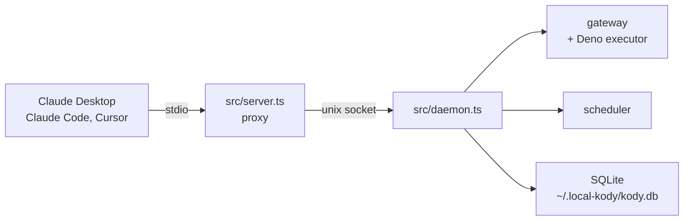
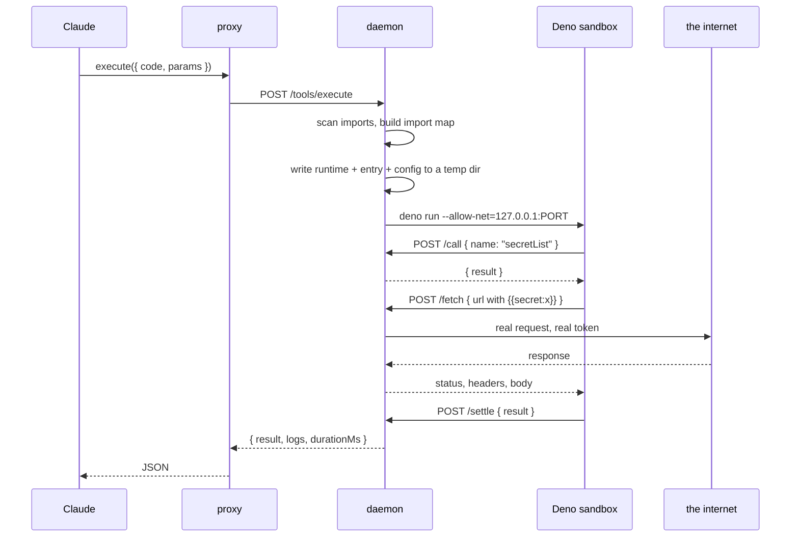

# How local-kody works

This explains the machine. If you want to use it, read the README. If you want to change it, read this first.

The pitch in one line: an agent gets a durable home on your Mac. It can write code, run it safely, save what worked, and put the saved code on a schedule. Nothing it writes can touch your filesystem, and it can use your API tokens without ever seeing them.

## The shape of the idea

Most MCP servers grow a tool per feature. Twenty tools in, the model spends its attention choosing between them and picks wrong. local-kody has two, forever:

- `search` finds things: capabilities, saved packages, guides, secret names, integrations, other MCP servers.
- `execute` runs one TypeScript module in a sandbox.

Everything else is a **capability**, a Zod-typed function in the host process that sandboxed code calls as `kody.notifySelf({ title, message })`. Capabilities are not MCP tools. The model finds them through `search` and calls them through `execute`. Adding a feature means adding a capability, and the tool list stays at two.

This inverts the usual arrangement. Instead of the model orchestrating many tools, it writes a program that orchestrates many capabilities, and the program runs once in one sandbox. Ten steps cost one round trip instead of ten.

## Two processes, and why



The process your MCP client spawns is a proxy and nothing else. It holds no state, opens no database, and forwards both tools to a Unix socket.

The split exists because of two facts about MCP clients. First, Claude Desktop owns its stdio child, so that process dies when you quit the app, and a job that fires at 8am needs something still breathing. Second, every client spawns its own copy, so if the store lived in the stdio process, Claude Desktop and Claude Code would fight over the same SQLite file. The daemon is the single writer, and launchd keeps it alive across logins and crashes.

The socket is `~/.local-kody/daemon.sock`, mode 0600. There is no TCP listener, so nothing on your network and no other user on the machine can reach it. It speaks plain JSON over HTTP, which means `curl --unix-socket` is a complete debugging client.

When the daemon is down, the proxy still answers. The tool result is an error telling you to run `npm run daemon:install`, because a model that gets a connection refused will invent an explanation, and a model that gets an instruction will relay it.

## What happens when the agent calls execute

This is the core loop. Everything else is detail hanging off it.



The daemon writes four things into a fresh temp directory:

- `entry.ts`, the code the model wrote, untouched.
- `main.ts`, a wrapper that imports the entry's default export, calls it with `params`, and posts the outcome back.
- `runtime-core.js`, the bridge to the gateway.
- `deno.json`, an import map.

Then it runs Deno with one permission: `--allow-net=127.0.0.1:<gateway port>`. No `--allow-read`, no `--allow-write`, no `--allow-env`, no `--allow-run`. `--no-prompt` means Deno refuses rather than asking, since nobody is at the keyboard. The gateway port is random per daemon start, so the grant is narrow.

Params travel as `Deno.args[0]`, a JSON string. This matters more than it looks: the model is told to keep values in `params` and logic in `code`, so the same module text can be saved as a package and reused with different inputs.

### What the sandbox cannot do

An e2e check asserts all four of these come back `NotCapable`:

```ts
Deno.readTextFile("/etc/hosts"); // no
Deno.env.get("HOME"); // no
new Deno.Command("ls").output(); // no
Deno.connect({ hostname: "1.1.1.1", port: 443 }); // no
```

The one thing it can do is talk to the gateway. So `globalThis.fetch` is replaced at startup: user code calling `fetch("https://api.github.com/...")` actually posts the request to the gateway, which performs it from the host and returns status, headers and body. `console.log` is replaced the same way, which is how log lines reach the tool result.

Both replacements live in `runtime-core.js`, which loads once per run no matter how many modules import the runtime. That matters because a second copy would capture the first copy's patched `fetch` as its "native" one and proxy the proxy.

## The gateway, and how secrets work

The gateway is an HTTP server on a random localhost port with six routes: `/call` runs a capability, `/fetch` performs a request, `/storage` reads and writes a package's bucket, `/mcp` calls a tool on another MCP server, `/log` collects a line, `/settle` delivers the final result. Every request carries the run id in a header, and a request for an unknown or finished run is refused.

Secrets are the reason the fetch proxy exists. Code writes a placeholder:

```ts
await fetch("https://api.github.com/user", {
  headers: { authorization: "Bearer {{secret:githubToken}}" },
});
```

The host reads the hostname from the URL, then substitutes `{{secret:name}}` in the URL, every header and the body, but only if that secret was approved for that hostname. Values only exist on the host side of the bridge. A capability that listed secret values would defeat this, so `secretList` returns names and approved hosts and there is deliberately no way to read a value back.

The value itself is not in the database or in any file local-kody writes. It is in the login Keychain under the service `local-kody`, and the host fetches it at the moment of substitution. What the database holds is the name and the list of approved hosts, which is why `secretList` and the search index never have to touch the Keychain at all.

Send the same token somewhere it was not approved for and you get an error naming the fix:

```
Secret "githubToken" is not approved for host localhost.
Ask the user to run: npm run secret -- allow githubToken localhost
```

That phrasing is a convention, not a courtesy. Every error across the bridge names the next step, because the reader is a model deciding what to do next, and "permission denied" gives it nothing to do.

## Services you log into

An API key is one thing; a Google account is another. For those there are **integrations**: saved OAuth connections, each with a provider config, a pair of tokens and a list of hosts its token may reach.

Connecting one is the only place in local-kody where the agent genuinely cannot finish the job. `kody.integrationStart({ id: "google" })` builds an authorize URL with PKCE and a random `state`, opens a one-shot HTTP listener on a loopback port, and points the redirect at it. Then it returns the URL and stops. A human clicks Allow. The provider redirects the browser back to `http://127.0.0.1:<port>/callback`, the daemon checks `state`, trades the code for tokens using the PKCE verifier, and answers the browser with a page that says it worked. Five minutes with no callback and the listener closes with a reason the agent can read in `integrationList`.

The agent polls for the outcome rather than waiting on it, because a sandbox run is capped at 60 seconds and approval takes as long as it takes.

After that it looks exactly like a secret:

```ts
headers: {
  authorization: "Bearer {{integration:google}}";
}
```

with one extra move on the host side. Before substituting, the gateway checks whether the access token expires within the next minute and refreshes it if so. Two runs hitting an expired token at the same moment would otherwise both spend the refresh token, and providers that rotate refresh tokens would invalidate whichever came second. So refreshes go through a map of in-flight promises keyed by integration: the second caller waits on the first one's request. A refresh the provider rejects flips the status to `needs_reconnect` and returns an error naming `integrationStart`, which is the one thing that fixes it.

Host approval is checked before any of that, so pointing a token at somewhere it was never meant to go does not even cost a refresh.

## Packages

A package is a folder under `~/.local-kody/packages/@scope/leaf` with a `package.json` whose `exports` map names callable modules. The folder is the source of truth. Saved code is imported by a custom scheme:

```ts
import whatShipped from "kody:@me/what-shipped/whatShipped";
```

Before running anything, the daemon scans the module's import statements and builds an import map. Bare names become npm specifiers. `kody:@scope/leaf/export` becomes the absolute path of that file, and the scan follows it, so a package importing another package pulls its dependencies in too.

The generated `deno.json` for a run looks roughly like this:

```json
{
  "imports": {
    "kody:runtime": "/tmp/kody-run-ab12/runtime-root.js",
    "kody:@me/what-shipped/whatShipped": "/Users/you/.local-kody/packages/@me/what-shipped/what-shipped.ts",
    "date-fns": "npm:date-fns"
  },
  "scopes": {
    "/Users/you/.local-kody/packages/@me/what-shipped/": {
      "kody:runtime": "/tmp/kody-run-ab12/runtime-7f3c9a61-....js",
      "date-fns": "npm:date-fns@4.4.0"
    }
  }
}
```

`scopes` is the interesting half. It is an import map feature that makes a specifier resolve differently depending on which file is doing the importing. Two things ride on it.

**Pinned versions.** Ad hoc code gets `npm:date-fns`, the latest. A saved package gets the exact version recorded when it was saved, so a package keeps running against what it was checked with.

**Package identity.** Each package in the run gets a random token and its own tiny facade module. Files inside that package's folder resolve `kody:runtime` to their facade; everything else gets the root one. The facade is four lines: it re-exports the shared core, bound to one token.

## Package storage, and the token trick

Each package gets a key/value bucket, and the binding is the point:

```ts
import { packageStorage } from "kody:runtime";

export default async function poll() {
  const storage = packageStorage();
  const since = await storage.get("cursor");
  // ...
  await storage.set("cursor", newest.id);
}
```

No namespace argument. The module does not say which bucket it wants, and cannot ask for another one. Its facade posts its token with every storage call, and the gateway maps token to package name. Two packages can both keep a key called `cursor` and never meet.

Ad hoc `execute` code has no package and therefore no token, so `packageStorage()` throws and tells you to save the code first.

Be clear about what this defends against. It stops one package clobbering another's keys by accident, which is a real bug that would otherwise be silent. It is not a defence against a hostile module, which runs on your machine and could read the token out of its own facade. Everything here assumes the code is yours.

## Saving a package

A bad package should fail when it is saved, not at 8am inside a job. So `packageSave` writes to a staging folder, runs four checks, and swaps the folder into place in one rename only if all four pass.

1. **The manifest is honest.** Every `exports` entry and every job entry points at a file you actually sent, and `kody.jobs` parses.
2. **Dependencies get pinned.** Every bare import is resolved to an exact version from the npm registry and written to `package.json#dependencies`. Versions already pinned are kept.
3. **It type checks.** `deno check` runs over every export and job entry with the package's own import map and a generated declaration for `kody:runtime`.
4. **It imports cleanly.** The sandbox imports each module and confirms its default export is a function, without calling it. A module that throws while loading is caught here.

Failures come back as one list, not one at a time, and nothing is written. The previous version keeps working. `files` is the whole package, not a patch: what you send replaces what was there.

Two notes on the type check. The declaration for `kody:runtime` is deliberately loose, `kody` typed as a record of async functions, because tightening it from the Zod schemas is work for later. And `noImplicitAny` is off, because package code is small scripts whose params arrive as JSON, and demanding annotations would reject most honest saves while catching nothing real. A wrong type still fails.

## Runs, and surviving a timeout

MCP clients time out. A model that gets a timeout does not know whether the work happened, and the obvious move, trying again, is the wrong one if the first call charged a credit card.

So `execute` takes an optional `idempotencyKey`:

- first call with a key: insert a `running` row, run the code, return the result and a `runId`,
- same key after it finished: return the stored result with `replayed: true`, no second sandbox,
- same key while it is still going: return `inProgress: true` and the `runId`.

A unique index on the key settles the race when two calls arrive together. The loser reads the winner's row.

Every job run is recorded. An `execute` is recorded when it fails, so a failure survives the conversation that caused it, and when it carries a key. Successful ad hoc runs are not recorded, because a log of every throwaway one-liner is noise.

Runs left `running` by a daemon that died are reconciled when the daemon next starts. Any such row older than the execute timeout plus a margin could not still have a live sandbox behind it, so it becomes an error marked `interrupted`.

There is an edge here worth knowing about. The check runs at startup and nowhere else, so a run stranded less than 90 seconds before the restart falls under the age threshold, survives the sweep, and stays `running` for good. Nothing reads it again. Calling `reconcileOnStartup()` from the scheduler tick as well would close it.

`kody.runList()` and `kody.runGet({ id })` read the history, including the logged lines.

## Jobs and the scheduler rule

A job belongs to the package that declares it. The package says what the job is, in its manifest:

```json
{
  "kody": {
    "jobs": {
      "daily-digest": {
        "entry": "./daily-digest.ts",
        "schedule": { "type": "cron", "expression": "0 8 * * *" },
        "timezone": "Europe/Paris"
      }
    }
  }
}
```

The store says whether and when it runs, so enabling a job never means rewriting the package. The entry is a package-local module taking no arguments, usually a thin wrapper that calls an export and notifies only when there is something to say.

Jobs arrive disabled, and a job that has never succeeded cannot be enabled. Run it once with `jobRunNow` first. A schedule you have never tested is a schedule you will debug at 8am, badly.

The scheduler rule is short and does more than it looks:

> Every 30 seconds, for each enabled job, compute the next occurrence after `last_scheduled_for`. If it is at or before now, run the job once and set `last_scheduled_for` to the **latest** occurrence at or before now.

That last word is the whole trick. Close the lid on Friday, open it on Monday, and a daily job has missed three mornings. Naive catch-up fires three times and sends three notifications. This rule fires once, because it jumps `last_scheduled_for` to the most recent missed occurrence rather than stepping through them. The same rule covers a daemon that was down, a Mac that slept, and a long upgrade, with no special case for any of them.

Cron parsing is [croner](https://github.com/hexagon/croner), which handles time zones, so "8am Europe/Paris" means 8am there through daylight saving.

The clock is a parameter. `tickScheduler(now)` takes the date, which is why `test/scheduler.ts` can prove the coalescing rule in milliseconds instead of waiting three days. The daemon passes `new Date()`; the test passes whatever it likes. The daemon also exposes `POST /scheduler/tick` on its socket with an optional `now`, so you can watch a schedule catch up by hand.

A job that fails sends a notification with its name and the first line of the error. A job that fails silently is worse than one that never ran.

## Being a client, not only a server

The same argument that says local-kody should have two tools says it should not grow a tool for Linear, one for a filesystem server, one for whatever comes next. So it calls other MCP servers instead: `kody.mcpAdd` registers one, `search` lists it as `mcp-server:<name>`, and sandbox code reaches its tools as `kody.mcp['linear'].create_issue(args)`. Those tools never appear in local-kody's own tool list, which stays two entries long.

The daemon keeps a lazy pool of client connections: a server starts on first use and closes after five idle minutes. Adding one connects immediately rather than at first use, because a server that cannot start should fail while someone is watching, and a failed add leaves nothing behind.

Credentials arrive the way they do everywhere else. A local server's secret goes into its environment, where `"{{secret:name}}"` is replaced as it starts. A remote server's is a bearer token from a secret or an integration, resolved at connect time so a refreshed token is picked up without reconfiguring anything.

One thing here is different in kind from the rest of the system. Everything else in local-kody is code you or your agent wrote, running on your machine. A remote MCP server's tool names, descriptions and results are written by someone else, and they arrive in the same text channel your agent reads its instructions from. They are data. `guides/mcp.md` says so in the words the agent will read, and the entity view labels a server's instructions as coming from that server, but the real defence is not handing a server a credential it did not already need.

## Where things live

Inside `~/.local-kody`:

| Path          | What                                                                                    |
| ------------- | --------------------------------------------------------------------------------------- |
| `packages/`   | One folder per saved package. The source of truth for code.                             |
| `kody.db`     | SQLite in WAL mode: package storage, run records, job schedule, secret names and hosts. |
| `daemon.sock` | The only listener, mode 0600.                                                           |
| `logs/`       | `daemon.log`, where launchd sends stdout and stderr.                                    |
| `staging/`    | Where a package is checked before it is swapped into place.                             |

Secret values live in the Keychain rather than here, so a backup of this folder carries no credentials.

Schema changes are an ordered list of SQL strings in `src/store.ts`. The index of the last applied one is the version, so adding a migration means appending a string.

## Things that might surprise you

**stdout belongs to MCP.** The proxy speaks JSON-RPC on stdout, so a stray `console.log` in host code corrupts the protocol and the client disconnects with a parse error. Host logging goes to stderr. Inside the sandbox `console.log` is safe, because it is routed over the gateway.

**Host functions never throw across the bridge.** Every gateway reply is `{ result }` or `{ error }`. A thrown exception would surface as a transport failure the model cannot read.

**Results are capped at 100 KB.** Past that you get an error asking for less. The model can fetch a megabyte, but it has to summarise before returning, which is the behaviour you want anyway.

**The first npm import is slow.** Deno downloads and caches it. The second run is fast.

**`search` ranks with plain lexical scoring**, no embeddings: a name hit scores 3, a keyword 2, a body word 1, with cheap prefix matching so "ship" finds "shipped". Saved packages get a point on top, because reusing a package beats rewriting it. This is the part most likely to want replacing.

## Reading the source

Start with `src/executor.ts`. It is the whole idea in one file: build the import map, write the runtime modules, spawn Deno with one permission, wait for `/settle`. Everything else supports it.

| File                  | What it does                                                |
| --------------------- | ----------------------------------------------------------- |
| `src/daemon.ts`       | The long-lived process: routes, startup, scheduler interval |
| `src/server.ts`       | The proxy. Forwards two tools and nothing more.             |
| `src/executor.ts`     | Import map, scopes, runtime modules, `deno run`             |
| `src/gateway.ts`      | The sandbox's only reachable address                        |
| `src/registry.ts`     | `defineCapability`, Zod validation                          |
| `src/capabilities.ts` | The sixteen capabilities themselves                         |
| `src/publish.ts`      | Staging, pinning, `deno check`, dry import, swap            |
| `src/jobs.ts`         | Job views, running one, the coalescing tick                 |
| `src/runs.ts`         | Recording, replay by key, reconciliation                    |
| `src/store.ts`        | SQLite, migrations, every table                             |
| `src/search.ts`       | Ranking and the entity detail pages                         |

`guides/*.md` are written for the model, not for you. They come back through `search`, which is how the agent learns to save a package or schedule a job without any of it being in the system prompt.
